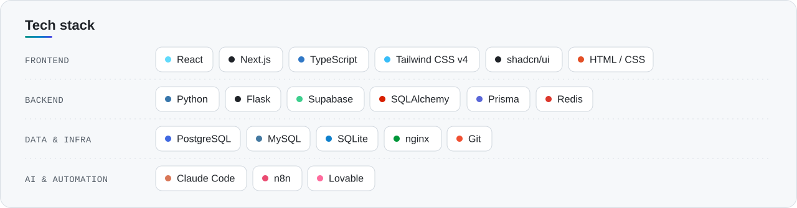
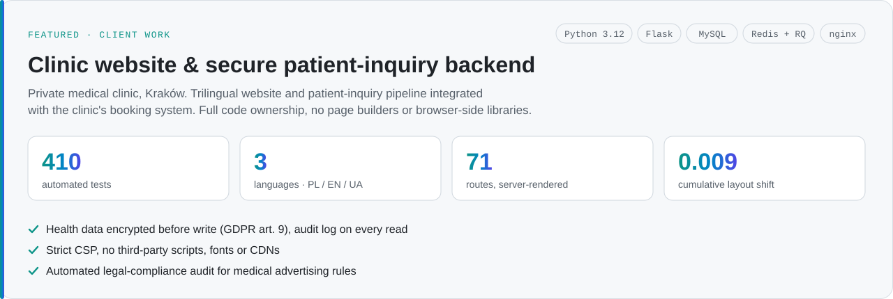

<!-- Profile README for github.com/Vex864 -->

<picture>
  <source media="(prefers-color-scheme: dark)" srcset="header-dark.svg">
  
</picture>

### About

Full-stack developer based in Kraków. I design and build websites and web applications for healthcare providers and small businesses, from first prototype to production deployment. My work focuses on data protection, test coverage and performance.

<picture>
  <source media="(prefers-color-scheme: dark)" srcset="stack-dark.svg">
  
</picture>

 

<picture>
  <source media="(prefers-color-scheme: dark)" srcset="project-clinic-dark.svg">
  
</picture>

Client repositories are private. Code walkthroughs available on request.

### Contact

<a href="https://www.linkedin.com/in/micha%C5%82-bucki/"><picture><source media="(prefers-color-scheme: dark)" srcset="btn-linkedin-dark.svg"></picture></a>
